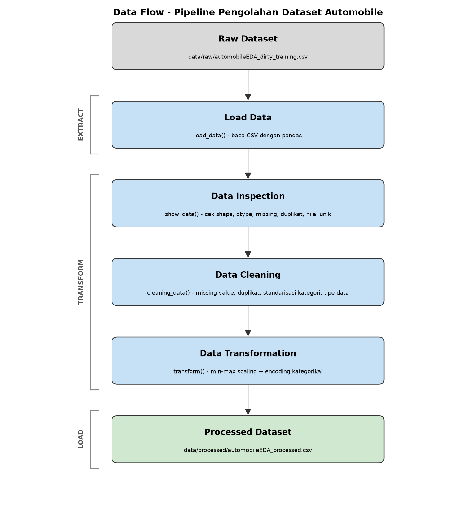

# Data Pipeline - Dataset Automobile

Pipeline sederhana buat ngolah dataset automobile dari data mentah sampai jadi
dataset yang siap dipakai untuk analisis atau modeling. Semua proses (baca,
periksa, cleaning, transform, simpan) ada di `src/pipeline.py` dan jalan sekali
eksekusi.

## Dataset

- **Deskripsi**: data spesifikasi mobil (merk, dimensi, mesin, harga, konsumsi
  bbm, dll). Versi mentahnya sengaja "dikotori" jadi ada missing value, baris
  dobel, dan penulisan kategori yang campur aduk.
- **Sumber**: Rework Academy https://s.id/dataset-sesi-3
  (`Dataset_Sesi_3.zip`).
- **File**:
  - `automobileEDA_dirty_training.csv` - input utama pipeline.
  - `automobile_processed.csv` - clean dataset dari mentor, dipakai buat
    pembanding aja, bukan output.

## Struktur folder

```
data-pipeline-assignment/
├── data/
│   ├── raw/
│   │   └── automobileEDA_dirty_training.csv     # data mentah, tidak diubah
│   └── processed/
│       ├── automobileEDA_processed.csv          # hasil pipeline (dibuat otomatis)
│       └── automobile_processed.csv             # referensi dari mentor
├── src/
│   └── pipeline.py                              # semua proses ETL
├── documentation/
│   ├── data-flow-diagram.png                    # diagram alur
│   └── data_flow_diagram.py                     # script pembuat diagram
├── main.py                                      # shortcut buat jalanin pipeline
├── requirements.txt
├── pyproject.toml
└── README.md
```

## Kondisi awal dataset

- Ukuran awal: **205 baris, 30 kolom**.
- Kolom yang punya missing value: `transaction_date` (2), `make` (2),
  `num-of-doors` (2), `stroke` (4), `horsepower` (3), `price` (3),
  `horsepower-binned` (1).
- Baris terduplikasi: **4 baris**.
- Kolom dengan tipe data belum sesuai: `transaction_date` kebaca sebagai teks,
  padahal isinya tanggal.
- Penulisan kategori yang belum konsisten:
  - `make`: huruf besar/kecil campur (`ALFA-ROMERO` vs `alfa-romero`, `Audi`,
    `BMW`) + ada spasi di belakang (`dodge  `, `mercury  `, `porsche  `).
  - `body-style`: `SEDAN`, `Sedan`, `sedan`.
  - `drive-wheels`: `AWD`, `RWD` campur sama `fwd`, `rwd`.
  - `fuel-system`: `MPFI`, `Mpfi`, `mpfi`.
  - `horsepower-binned`: `High`, `Low`, `Medium` (harusnya huruf kecil).
- Masalah lain: `transaction_date` formatnya campur (`2025-01-01`, `02/01/2025`,
  `01-03-2025`, `04-Jan-2025`). Placeholder `N/A`, `-`, `unknown` ikut dicek
  walaupun di dataset ini tidak ketemu.

## Cleaning yang dilakukan

| Masalah | Kolom | Metode | Alasan |
|---|---|---|---|
| Placeholder teks dianggap data | semua kolom | ganti `N/A`, `-`, `unknown` jadi `NaN` | biar semua nilai kosong dihitung sama |
| Missing value numerik | `stroke`, `horsepower`, `price` | isi pakai `mean` kolom | jumlahnya sedikit, dibuang sayang, mean tidak menggeser distribusi jauh |
| Missing value kategorikal | `make`, `num-of-doors`, `horsepower-binned` | isi pakai modus (nilai paling sering) | kategori tidak bisa dirata-rata |
| Tipe data salah | `transaction_date` | `pd.to_datetime` (format campur, error jadi `NaT`) | isinya tanggal tapi kebaca teks |
| Baris dobel | semua kolom | `drop_duplicates(keep="first")` | 4 baris identik, tidak menambah informasi |
| Kategori tidak konsisten | `make`, `body-style`, `drive-wheels`, `fuel-system`, `engine-type`, dll | `strip` + `lower` + hapus spasi | `SEDAN` / `Sedan` / `sedan` harusnya satu kategori |

Kolom yang berubah setelah cleaning: `transaction_date`, `make`, `num-of-doors`,
`body-style`, `drive-wheels`, `fuel-system`, `stroke`, `horsepower`, `price`,
`horsepower-binned`.

## Transformasi yang dilakukan

| Kolom | Metode | Alasan |
|---|---|---|
| 16 kolom numerik (`normalized-losses`, `wheel-base`, `length`, `width`, `height`, `curb-weight`, `engine-size`, `bore`, `stroke`, `compression-ratio`, `horsepower`, `peak-rpm`, `city-mpg`, `highway-mpg`, `price`, `city-L/100km`) | Min-Max Scaling ke rentang 0-1 | skalanya beda jauh (harga ribuan, `bore` di bawah 4), disamakan dulu |
| `aspiration`, `num-of-doors`, `engine-location` | Label Encoding (0/1) | cuma 2 kategori |
| `horsepower-binned` (`low`/`medium`/`high`), `num-of-cylinders` (`two`..`twelve`) | Ordinal mapping | kategorinya punya urutan |
| `body-style`, `drive-wheels`, `engine-type`, `fuel-system` | One-Hot Encoding (`drop_first=True`) | nominal, tidak ada urutan |
| `make` | Frequency Encoding jadi `make_encoded`, kolom `make` dihapus | kategorinya banyak (22), one-hot bikin kolom meledak |

Kolom bertambah dari **30 jadi 45** karena one-hot menghasilkan banyak kolom
dummy dan `make` diganti `make_encoded`.

### Contoh sebelum dan sesudah transformasi

| Kolom | Sebelum | Sesudah | Metode |
|---|---|---|---|
| `price` (baris 1) | 13495.0 | 0.2080 | Min-Max |
| `horsepower` (baris 1) | 111.0 | 0.2944 | Min-Max |
| `curb-weight` (baris 1) | 2548 | 0.4112 | Min-Max |
| `aspiration` (baris 1) | `std` | 0 | Label |
| `horsepower-binned` (baris 1) | `Medium` | 1 | Ordinal |
| `num-of-cylinders` (baris 3) | `six` | 6 | Ordinal |
| `make` (baris 1) | `alfa-romero` | `make_encoded` = 0.0149 | Frequency |
| `body-style` (baris 1) | `convertible` | `body-style_sedan=False`, `body-style_hatchback=False`, ... | One-Hot |

## Jumlah data sebelum dan sesudah diproses

| Tahap | Baris | Kolom |
|---|---|---|
| Data mentah | 205 | 30 |
| Setelah cleaning | 201 | 30 |
| Setelah transformasi (processed) | 201 | 45 |

## Cara install dependency

Pakai pip:

```bash
pip install -r requirements.txt
```

Atau pakai uv:

```bash
uv sync
```

## Cara menjalankan pipeline

Dari folder project:

```bash
python src/pipeline.py
```

Atau lewat shortcut:

```bash
python main.py
```

Semua hasil pemeriksaan, cleaning, dan transformasi ditampilkan di terminal.
Path dataset dihitung dari lokasi file, jadi bisa dijalankan dari folder mana
saja.

Buat regenerate diagram alur:

```bash
python documentation/data_flow_diagram.py
```

## Alur ETL

| Tahap | Proses | Function |
|---|---|---|
| Extract | baca CSV dari `data/raw/` | `load_data()` |
| Transform | periksa kondisi awal, cleaning, normalisasi + encoding | `show_data()`, `cleaning_data()`, `transform()` |
| Load | simpan processed dataset ke `data/processed/` | `save_data()` |

`main()` di `pipeline.py` yang merangkai semuanya jadi satu jalur:
`load_data -> show_data -> cleaning_data -> transform -> save_data`.



## Lokasi processed dataset

`data/processed/automobileEDA_processed.csv`

File ini dibuat otomatis tiap kali pipeline dijalankan, bukan hasil copy dari
clean dataset mentor. Dataset mentah di `data/raw/` tidak pernah diubah.
